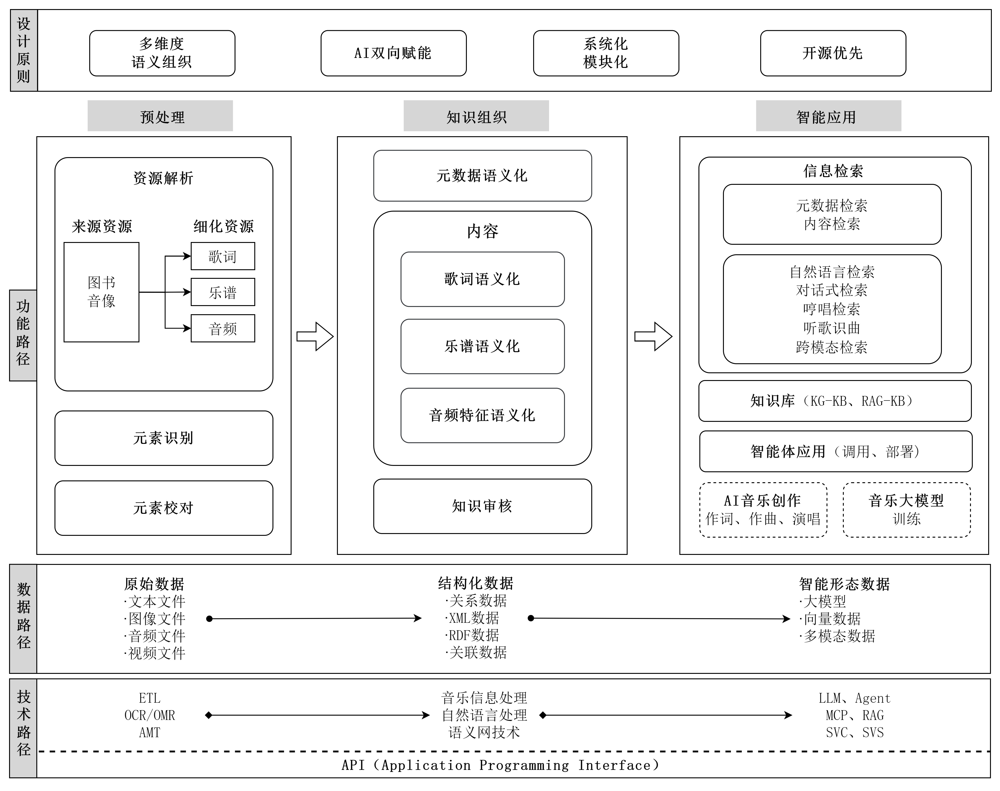
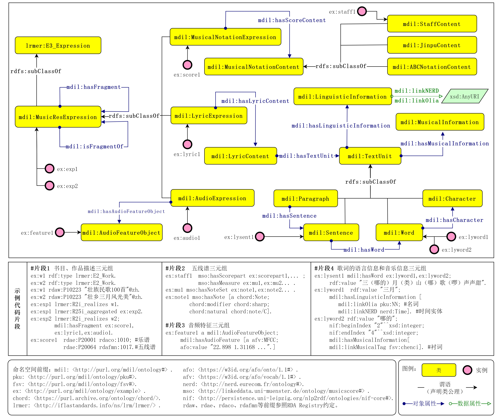
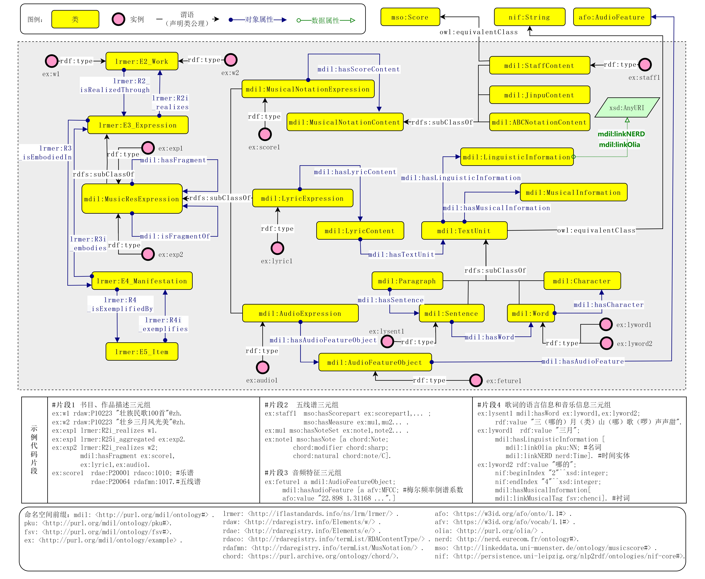
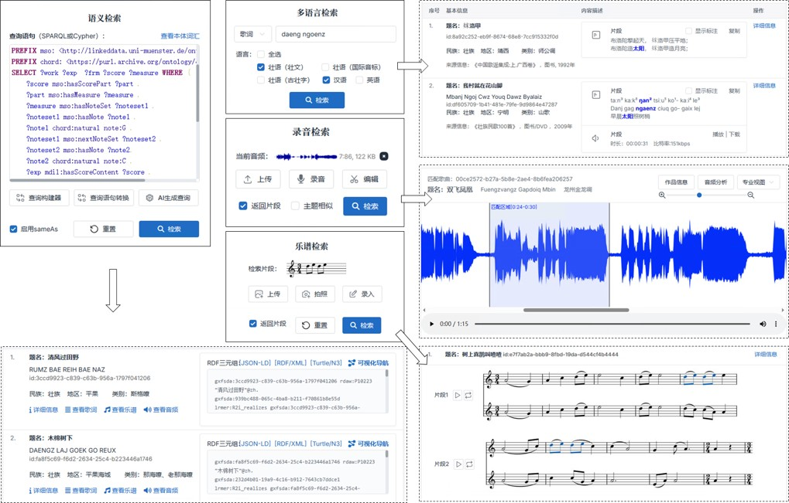

# Music Digital Intelligence Library (MDIL) 音乐数智图书馆
MDIL是利用智能技术深入音乐资源作品元数据和内容层面进行知识组织，实现音乐资源的数字化、数据化和智能化，旨在促进数智环境下音乐资源转化和利用的知识服务平台。
本开源仓库主要存放MDIL项目本体、代码和原型系统等相关资源。

## 一、音乐数智图书馆的构建框架

## 二、MDIL本体模型和示例

（包含外部本体）  

## 三、原型系统

广西原生态民歌数智图书馆的语义检索等功能界面  

相关资源持续更新。
联系方式：blackjack_edu@hotmail.com